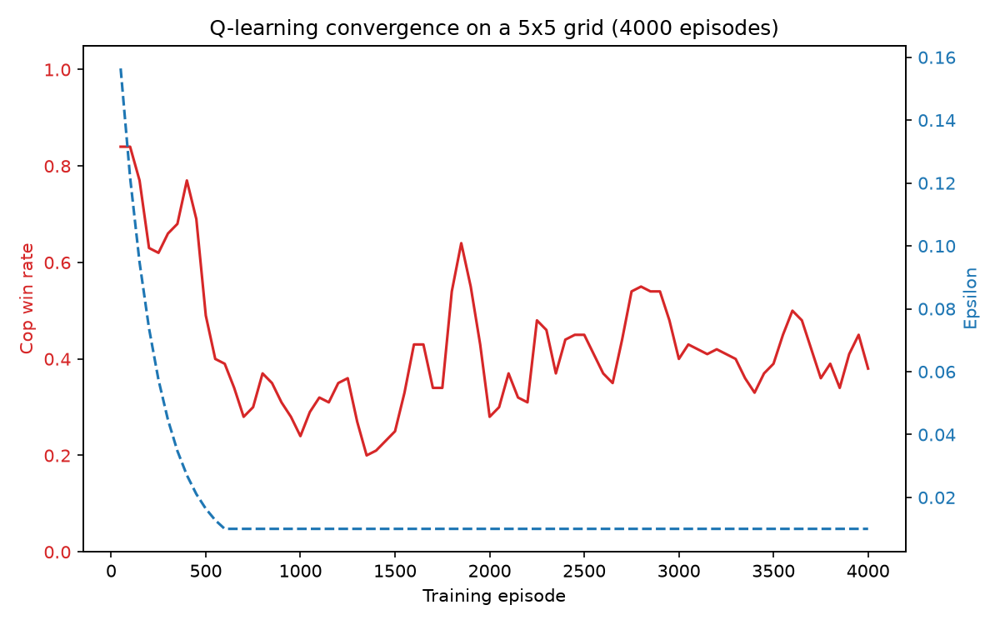

# Cop & Thief: MCP-Based Multi-Agent Pursuit Game

Two independent AI agents — a **Cop** and a **Thief** — communicate
exclusively through **free natural language** over two separate MCP
servers, each with no visibility into the other's exact state, and play a
complete 6-round pursuit game end to end, with results self-reported by
email.

> Two independent AI agents, each behind its own MCP server, communicate
> only in free natural language (no rigid coordinate protocol) and
> autonomously play a complete 6-round pursuit game, inferring each
> other's position from partial observations and self-reporting the final
> result. — the central claim this project proves (`docs/PRD.md`).

See `docs/PRD.md` for goals/KPIs, `docs/PLAN.md` for architecture (C4
diagrams, ADRs), `docs/TODO.md` for the full task history, and
`reports/technical_report.md` for the extended write-up (full results
across the grid-size progression, the four required-questions discussion,
qualitative transcript review).

## Repository layout

See `docs/PLAN.md` for the annotated structure. In short:

- `src/` — engine, MCP servers, agent orchestrators, strategy, GUI, reporting
- `config/config.yaml` — every tunable parameter (grid size, scoring, etc.)
- `docs/` — planning and design docs (PRD, PLAN, TODO, CONCEPTS, API, PROMPTS)
- `tests/` — unit tests (target ≥85% coverage; currently 91%)
- `scripts/` — entrypoints (run servers, run the LLM demo, train Q-learning,
  plot the learning curve, check cloud reachability)
- `results/`, `figures/`, `reports/` — run outputs, generated graphs, the
  extended technical writeup

## Dec-POMDP formal model

The generic Decentralized Partially Observable Markov Decision Process
tuple is `⟨n, S, {Ai}, P, R, {Ωi}, O, γ⟩`. Mapped onto this project's
actual state representation and code, not restated generically:

| Symbol | Generic meaning | This project's instantiation |
|---|---|---|
| `n` | number of agents | 2 — Cop and Thief, each one `AgentOrchestrator` (`src/agents/`) + one independent MCP server |
| `S` | full state space | `(cop_pos, thief_pos, barrier_set, move_count)` — exists in full only in the orchestrator's private `Board` mirror (`src/engine/board.py`); neither MCP server ever holds both agents' positions |
| `A_cop` | Cop's action set | 8 movement directions + `place_barrier` (capped at `max_barriers`, rejected once exhausted) |
| `A_thief` | Thief's action set | 8 movement directions only — `choose_action(place_barrier=True)` is rejected server-side for the Thief |
| `P` | transition function | Deterministic given a legal action; illegal moves (off-board, into a barrier) are rejected as no-ops |
| `R` | reward function | The scoring table in `config.yaml` (`scoring.cop_win/thief_win/cop_loss/thief_loss`), realized terminally per sub-game; Q-learning additionally uses an internal per-step Δ-distance shaping reward, never part of the graded score |
| `Ω_cop`, `Ω_thief` | per-agent observation space | own exact position always; opponent's exact position only within `observation.visibility_radius`; otherwise nothing but whatever the opponent's free-text message claims |
| `O` | observation function | Two channels of very different reliability: `observe_opponent` (exact but rare — only in radius) and the NL channel (always available but adversarially noisy, since the Thief deliberately injects misleading claims via `choose_deception_level`). `src/agents/belief.py` resolves this: direct observation always overrides the NL estimate; an NL claim that implies an impossible jump since the last estimate is downgraded to low confidence rather than trusted outright; with no estimate at all, the opponent's position becomes a reserved sentinel (`UNKNOWN_POSITION`, `src/engine/board.py`), not a real coordinate |
| `γ` | discount factor | `config.yaml: strategy.q_learning.gamma` — used only by the optional Q-learning strategy layer |

This two-channel `O` is the one place this project's model departs from
the textbook single-channel observation function — see
`reports/technical_report.md` §2 for the full discussion of why that
departure matters.

## Orchestration-challenge analysis

The core engineering challenge: no fixed message schema between agents,
just free text parsed by an LLM every turn. Three concrete difficulties
surfaced in real runs (full transcripts in `results/transcripts/`):

**Bluffing is indistinguishable from model error at the text level.** One
Thief message read *"I'm heading south... nowhere near the north end"*
while its logged action was a move north — `choose_deception_level`
correctly picking "mislead" that turn, not a parsing failure. The design
choice was to log the mismatch and let the opponent's belief-update step
weigh it, never to "correct" it — doing otherwise would leak ground truth
across the exact boundary this assignment is built to test.

**Genuine vagueness has to be a valid outcome, not an error path.** Nearly
every message classified `"no reliable information"` across recorded runs
was a legitimately vague spatial description (*"I'm somewhere in the
middle of the grid"*), not an API/JSON failure — `src/agents/belief.py`
treats "no reliable information" as an explicit, first-class result.

**A fixed default belief shapes physical behavior in a way a rigid
protocol would never surface.** The original default (always the grid
center) made a distance-maximizing Thief oscillate between the same two
cells whenever its belief was unknown — a real, exploitable pattern,
fixed by replacing the default with an explicit off-board sentinel
(`UNKNOWN_POSITION`) that both the heuristic and Q-learning strategies
treat as "I genuinely don't know" instead of a fake real position (see
`docs/PLAN.md` ADR-6). A physical-plausibility check on the NL-derived
belief (an implied jump farther than one cell per turn caps confidence at
"low") was added for the same reason — to stop an internally-inconsistent
bluff from making the believer falsely confident. Full detail:
`docs/prd/nl-dialogue.md`, `reports/technical_report.md` §3.

## Installation

```bash
uv venv
uv pip install -r requirements.txt
```

(or `python -m venv .venv && pip install -r requirements.txt` if not using
`uv`).

Copy `.env.example` to `.env` and fill in:

- `ANTHROPIC_API_KEY` — required for any real LLM-driven run.
- `COP_MCP_AUTH_TOKEN` / `THIEF_MCP_AUTH_TOKEN` — bearer tokens for the two
  MCP servers (generate your own; never commit real values).
- `COP_MCP_URL` / `THIEF_MCP_URL` — only needed once you're pointing the
  demo at cloud-deployed servers rather than running them locally.
- `GMAIL_CLIENT_SECRET_PATH` / `GMAIL_TOKEN_PATH` — only needed for
  automated email reporting; the demo skips reporting with a clear message
  if these are unset.

Review `config/config.yaml` — see **Configuration guide** below.

## Usage

### Local run (no cloud deployment needed)

```bash
# Terminal 1 — both MCP servers in one process, for local dev
python scripts/run_mcp_servers.py

# Terminal 2 — drives a full 6-sub-game series through the MCP chain
python scripts/run_llm_demo.py
```

`run_llm_demo.py` runs the full series, writes a transcript per sub-game to
`results/transcripts/`, writes the live GUI state snapshot, and (if Gmail
credentials are set) sends the Internal Game JSON report automatically
after the 6th sub-game.

To watch the live board while a series runs:

```bash
streamlit run src/gui/app.py
```

### Cloud run

Each MCP server can run standalone (one per process/host) via:

```bash
MCP_SERVER_ROLE=cop   PORT=8001 python scripts/run_mcp_servers.py
MCP_SERVER_ROLE=thief PORT=8002 python scripts/run_mcp_servers.py
```

Point your hosting platform at this entrypoint per server. Once both are
deployed, set `COP_MCP_URL`/`THIEF_MCP_URL` in `.env` and verify reachability:

```bash
python scripts/check_cloud_reachability.py
```

The email body is a **compact summary**, not a full transcript — each
`sub_games` entry carries `winner`, `moves_taken`, final positions,
`barriers_placed`, and points only (see `docs/prd/email-reporting.md`'s
decision note on this, including why — the official schema example shows
`"sub_games": []` and the email's stated purpose is automated grading
intake, not human-readable transcripts). The full per-turn NL transcripts
that prove autonomous communication happened are saved separately, to
`results/transcripts/*.txt`, and are not part of the emailed JSON.

### Offline Q-learning training (optional strategy)

```bash
python scripts/train_q_learning.py                   # partial-observability mode (default, matches the real game)
python scripts/train_q_learning.py --full-visibility  # legacy mode, kept for comparison only
python scripts/plot_learning_curve.py   # renders figures/learning_curve.png
```

The default heuristic strategy and the Q-learning fallback share a single
"unknown opponent position" representation (`UNKNOWN_POSITION` in
`src/engine/board.py`) — see `docs/prd/strategy.md`'s calibration record
for why the partial-observability retrain doesn't converge as cleanly as
the old full-visibility run, and why that's a real finding, not a bug.

### Bonus inter-group run

Not currently pursued (deferred per `docs/TODO.md` Phase 7); would reuse
the same cloud-run setup against a partner group's independently-deployed
MCP server URLs.

## Visualizations and evidence

**Learning curve** (Q-learning, partial-observability retrain, 4000
episodes, 5×5 grid):



Rolling Cop win-rate oscillates noisily between ~0.23 and ~0.69 rather
than converging — a genuine finding (a single shared "unknown" state
bucket can't represent a turn-varying correct answer under partial
observability), not a tuning failure. Full discussion:
`docs/prd/strategy.md`.

**GUI** (Streamlit live game state, captured from a real run's final
snapshot):


**CLI log proving real communication over the deployed cloud MCP
servers** (2026-06-25, `python scripts/run_llm_demo.py` against
`config.yaml: mcp.{cop,thief}_mcp_url`, both pointing at Render):

```
Running against deployed servers: cop=https://cop-mcp-server.onrender.com/mcp, thief=https://thief-mcp-server-u04c.onrender.com/mcp
Sub-game 1: cop wins in 5 moves -> results/transcripts/subgame_5x5_01_cop.txt
Sub-game 2: cop wins in 8 moves -> results/transcripts/subgame_5x5_02_cop.txt
Sub-game 3: cop wins in 1 moves -> results/transcripts/subgame_5x5_03_cop.txt
Sub-game 4: cop wins in 3 moves -> results/transcripts/subgame_5x5_04_cop.txt
Sub-game 5: cop wins in 3 moves -> results/transcripts/subgame_5x5_05_cop.txt
Sub-game 6: thief wins in 25 moves -> results/transcripts/subgame_5x5_06_thief.txt
Series totals: {'cop': 105, 'thief': 35}
Report emailed to rosakhell28@gmail.com (message id 19efe1e1e73946e2).
```

No technical losses; all 6 sub-games completed on the first attempt
against the live, independently-deployed Cop and Thief servers — not a
local/simulated stand-in. Full transcripts for every sub-game referenced
above are committed under `results/transcripts/`.

## Configuration guide

Everything tunable lives in `config/config.yaml` — nothing in `src/` should
hardcode a value that belongs here:

| Section | Key parameters |
|---|---|
| `board` | `grid_size`, `max_barriers` |
| `game` | `max_moves` (per sub-game), `num_games` (sub-games per series) |
| `scoring` | per-outcome point values (capture / survival, both sides) |
| `observation` | `visibility_radius` — partial-observability range |
| `llm` | `provider`, `model` — which LLM the orchestrators call |
| `strategy` | `algorithm` (`heuristic` or `q_learning`), plus
  `q_learning.{alpha,gamma,epsilon,epsilon_decay,epsilon_floor}` |
| `mcp` | `cop_mcp_url`, `thief_mcp_url`, ports for local dev |
| `reporting` | `recipient_email` |
| `group` | `group_name`, `students`, `github_repo` — fill in before a real
  Gmail send; the report payload includes this |

## Tests

```bash
pytest --cov=src --cov-report=term-missing
```

111 tests, 91% project-wide coverage at last check (target ≥85%).

## Contributing

This is a course assignment with a single-team scope (see `docs/PRD.md`'s
assumptions). If extending it: keep the Client/Server split strict (no LLM
import under `src/mcp_servers/`), keep strategy code belief-agnostic (it
should only ever consume a `Board`, never an MCP session directly), and
add a test alongside any new module before treating it as done — see
`docs/TODO.md`'s phase breakdown for the pattern this project followed.

## License

MIT — see `LICENSE`.
