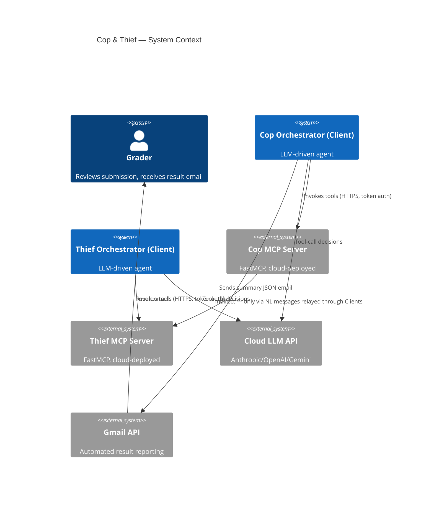
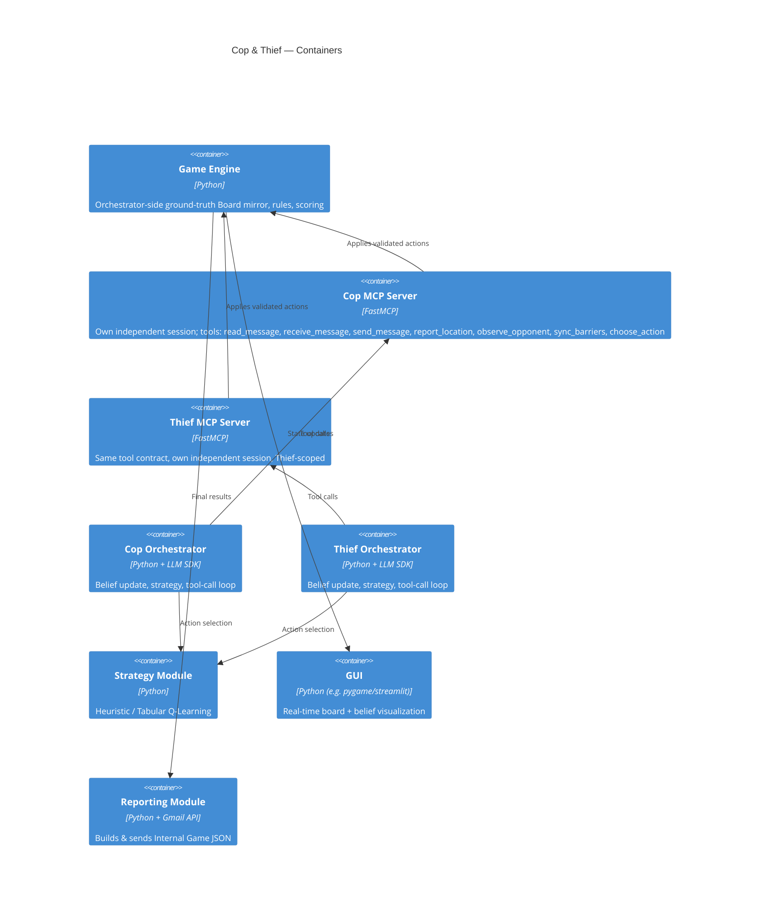

# PLAN — Architecture & Technical Design

## C4 — Context



## C4 — Container



## UML — Sub-game turn sequence

```mermaid
sequenceDiagram
participant T as Thief Orchestrator
participant TM as Thief MCP Server
participant E as Game Engine
participant CM as Cop MCP Server
participant C as Cop Orchestrator

T->>TM: choose_action(tool call, via LLM decision)
TM-->>T: result (validated against Thief's own session only)
T->>T: apply same action to its local ground-truth Board mirror (E)
T->>TM: send_message(NL text) [bookkeeping only]
T->>CM: receive_message(from_agent="thief", text) [orchestrator relays — servers never call each other]
C->>CM: read_message
C->>C: LLM updates belief from NL + observe_opponent(opponent_position supplied by T)
C->>CM: choose_action(tool call)
CM-->>C: result (validated against Cop's own session only)
C->>C: apply action to E; capture check against E (both true positions)
C->>TM: sync_barriers(...) [only if Cop placed a barrier]
Note over T,C: repeat until capture or max_moves reached — E (the ground-truth\nmirror) lives only in the orchestrator; neither MCP server ever sees it
```

## Architectural decisions (ADRs)

### ADR-1: LLM deployment approach

- **Decision:** Approach 1 — public cloud API, direct Anthropic API
  (`claude-haiku-4-5-20251001`), paid tier.
- **Rationale:** Simplest to stand up reliably for grading; conversations
  are short so token cost stays low (this workload's full token volume
  across the whole assignment's expected ~8-12 runs is on the order of
  $1-3 even at Haiku pricing); avoids exposing a local machine or dealing
  with firewall/NAT issues during a graded cloud run. A dedicated paid key
  has no shared-pool contention, unlike the free tiers tried first.
- **History:** Groq's free tier (`llama-3.1-8b-instant`) hit a 6,000
  token/minute cap almost immediately under this workload's ~2 LLM
  calls/turn, causing multi-minute stalls. OpenRouter's free-tier models
  (tried next, with a model-fallback list) turned out to be rate-limited
  upstream in a *global* pool shared across all OpenRouter users, not just
  this key — unpredictable independent of our own usage. Settled on a
  paid Anthropic key for a dedicated, non-shared capacity. Full history in
  the `docs/TODO.md` notes log.
- **Alternatives considered:** Approach 2 (secured local Ollama) rejected —
  adds a mandatory security layer (ngrok/Nginx) for marginal benefit on a
  short-lived academic project. Approach 3 (hybrid) reconsidered only if
  cloud API costs or rate limits become a problem.

### ADR-2: MCP framework

- **Decision:** FastMCP, per the assignment's explicit recommendation.
- **Rationale:** Decorator-based tool registration minimizes boilerplate;
  well-documented Client/Server separation matches the required
  architecture directly.

### ADR-3: Strategy module

- **Decision:** Start with a Manhattan-distance heuristic; add Tabular
  Q-Learning once the heuristic pipeline is verified end to end (Phase 3).
- **Rationale:** Heuristics de-risk the orchestration work first (the
  actual graded "essence" of the assignment); Q-learning is then layered in
  as the optional skill ceiling without blocking earlier phases.
- **Trade-off:** Q-learning needs many episodes to converge on small grids;
  the sanity-check progression (1×2 → 2×3 → 3×4 → 5×5) exists partly to
  surface this early.

### ADR-4: Config format

- **Decision:** `config/config.yaml` (YAML over JSON) for human-editable
  comments next to each parameter.

### ADR-5: No object shared between the Cop and Thief MCP servers

- **Decision:** each server owns its own independent `AgentSession`
  (own position, own barrier set, own inbox) — see
  `src/mcp_servers/session.py`. The orchestrator is the only thing that
  ever sees both agents' true positions, via its own `Board` mirror
  (`src/engine/board.py`, reused as-is from Phase 1); it relays messages
  between servers (`receive_message`), syncs barrier placements
  (`sync_barriers`), and computes capture/visibility itself.
- **History:** Phase 1/2/4 originally had both servers built from one
  shared `GameSession` object in the same process — convenient, but it
  only worked because both servers ran in one process. It silently broke
  the "two independent servers" requirement the moment they'd be deployed
  separately, and made the planned Phase 7 bonus (talking to a partner
  group's independently-deployed server) impossible outright. Phase 5
  replaced it with this design before doing any real cloud deployment.
- **Rationale:** matches the Dec-POMDP framing more faithfully too — the
  environment (full state `S`) should be owned by the system stepping it
  forward, not by one player's own infrastructure; the orchestrator is
  that stepping mechanism, and now actually behaves like it.
- **Trade-off:** more tool calls per turn (an explicit relay/sync call
  instead of a free shared write) and two new tools
  (`receive_message`, `sync_barriers`) beyond the assignment's minimum
  list — both within the assignment's explicit allowance for custom
  tools/rules that don't contradict the core instructions.

## Data flow

```
config.yaml → game engine (board, rules, scoring)
            → MCP servers (validate + apply tool-invoked actions)
            → agent orchestrators (LLM belief update + strategy + NL generation)
            → NL dialogue (the only inter-agent channel)
            → scoring (per sub-game, accumulated across 6)
            → reporting (Internal Game JSON → Gmail)
```

## API and data schemas

Full MCP tool contracts live in `docs/API.md` (filled in during Phase 2).
JSON report schemas (Internal Game JSON, Inter-Group Bonus Game JSON) are
specified verbatim in `hw06_requirements.md` §11 and re-validated by a test
in `tests/` before the reporting module ships.

## Bonus partnership (if pursued)

To be filled in once a partner group is locked in: which code/architecture
is shared vs. which agent implementation + strategy stays unique to each
group, and the agreed Inter-Group Bonus Game JSON schema.
