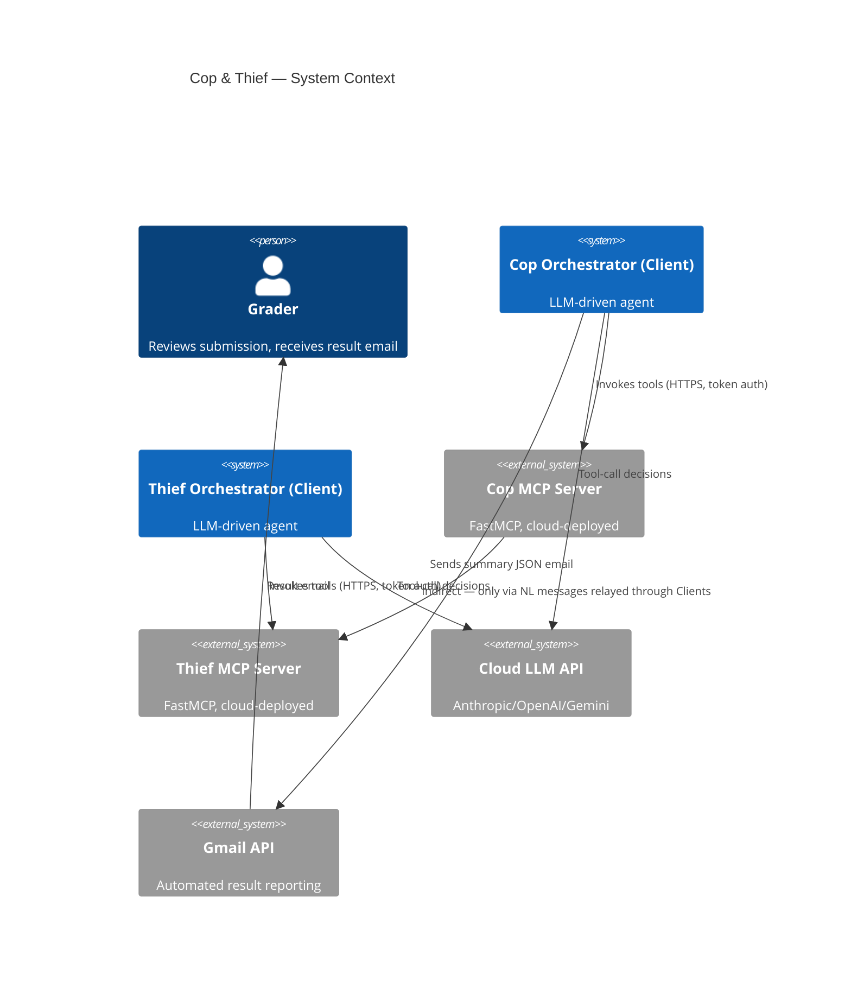
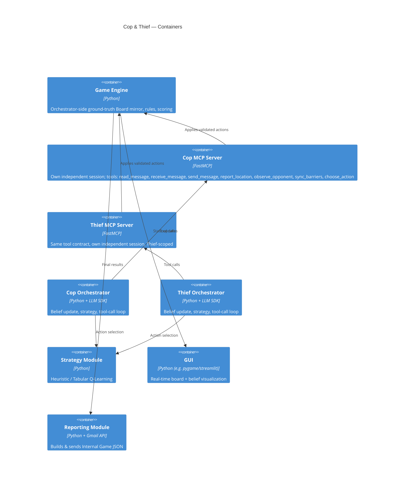

# PLAN — Architecture & Technical Design

## C4 — Context



## C4 — Container



## UML — Sub-game turn sequence

```mermaid
sequenceDiagram
participant T as Thief Orchestrator
participant TM as Thief MCP Server
participant E as Game Engine
participant CM as Cop MCP Server
participant C as Cop Orchestrator

T->>TM: choose_action(tool call, via LLM decision)
TM-->>T: result (validated against Thief's own session only)
T->>T: apply same action to its local ground-truth Board mirror (E)
T->>TM: send_message(NL text) [bookkeeping only]
T->>CM: receive_message(from_agent="thief", text) [orchestrator relays — servers never call each other]
C->>CM: read_message
C->>C: LLM updates belief from NL + observe_opponent(opponent_position supplied by T)
C->>CM: choose_action(tool call)
CM-->>C: result (validated against Cop's own session only)
C->>C: apply action to E; capture check against E (both true positions)
C->>TM: sync_barriers(...) [only if Cop placed a barrier]
Note over T,C: repeat until capture or max_moves reached — E (the ground-truth\nmirror) lives only in the orchestrator; neither MCP server ever sees it
```

## Architectural decisions (ADRs)

### ADR-1: LLM deployment approach

- **Decision:** Approach 1 — public cloud API, direct Anthropic API
  (`claude-haiku-4-5-20251001`), paid tier.
- **Rationale:** Simplest to stand up reliably for grading; conversations
  are short so token cost stays low (this workload's full token volume
  across the whole assignment's expected ~8-12 runs is on the order of
  $1-3 even at Haiku pricing); avoids exposing a local machine or dealing
  with firewall/NAT issues during a graded cloud run. A dedicated paid key
  has no shared-pool contention, unlike the free tiers tried first.
- **History:** Groq's free tier (`llama-3.1-8b-instant`) hit a 6,000
  token/minute cap almost immediately under this workload's ~2 LLM
  calls/turn, causing multi-minute stalls. OpenRouter's free-tier models
  (tried next, with a model-fallback list) turned out to be rate-limited
  upstream in a *global* pool shared across all OpenRouter users, not just
  this key — unpredictable independent of our own usage. Settled on a
  paid Anthropic key for a dedicated, non-shared capacity. Full history in
  the `docs/TODO.md` notes log.
- **Alternatives considered:** Approach 2 (secured local Ollama) rejected —
  adds a mandatory security layer (ngrok/Nginx) for marginal benefit on a
  short-lived academic project. Approach 3 (hybrid) reconsidered only if
  cloud API costs or rate limits become a problem.

### ADR-2: MCP framework

- **Decision:** FastMCP, per the assignment's explicit recommendation.
- **Rationale:** Decorator-based tool registration minimizes boilerplate;
  well-documented Client/Server separation matches the required
  architecture directly.

### ADR-3: Strategy module

- **Decision:** Start with a Manhattan-distance heuristic; add Tabular
  Q-Learning once the heuristic pipeline is verified end to end (Phase 3).
- **Rationale:** Heuristics de-risk the orchestration work first (the
  actual graded "essence" of the assignment); Q-learning is then layered in
  as the optional skill ceiling without blocking earlier phases.
- **Trade-off:** Q-learning needs many episodes to converge on small grids;
  the sanity-check progression (1×2 → 2×3 → 3×4 → 5×5) exists partly to
  surface this early.

### ADR-4: Config format

- **Decision:** `config/config.yaml` (YAML over JSON) for human-editable
  comments next to each parameter.

### ADR-5: No object shared between the Cop and Thief MCP servers

- **Decision:** each server owns its own independent `AgentSession`
  (own position, own barrier set, own inbox) — see
  `src/mcp_servers/session.py`. The orchestrator is the only thing that
  ever sees both agents' true positions, via its own `Board` mirror
  (`src/engine/board.py`, reused as-is from Phase 1); it relays messages
  between servers (`receive_message`), syncs barrier placements
  (`sync_barriers`), and computes capture/visibility itself.
- **History:** Phase 1/2/4 originally had both servers built from one
  shared `GameSession` object in the same process — convenient, but it
  only worked because both servers ran in one process. It silently broke
  the "two independent servers" requirement the moment they'd be deployed
  separately, and made the planned Phase 7 bonus (talking to a partner
  group's independently-deployed server) impossible outright. Phase 5
  replaced it with this design before doing any real cloud deployment.
- **Rationale:** matches the Dec-POMDP framing more faithfully too — the
  environment (full state `S`) should be owned by the system stepping it
  forward, not by one player's own infrastructure; the orchestrator is
  that stepping mechanism, and now actually behaves like it.
- **Trade-off:** more tool calls per turn (an explicit relay/sync call
  instead of a free shared write) and two new tools
  (`receive_message`, `sync_barriers`) beyond the assignment's minimum
  list — both within the assignment's explicit allowance for custom
  tools/rules that don't contradict the core instructions.

### ADR-6: Shared "unknown opponent position" sentinel, defined in the engine

- **Decision:** when an agent's belief about the opponent has no estimate
  (`Belief.estimate is None`), the belief-aware proxy board
  (`src.agents.belief.make_belief_board`) sets the opponent's position to
  `UNKNOWN_POSITION = (-1, -1)` — a reserved off-board sentinel defined in
  `src/engine/board.py`, not in `src/agents`.
- **History:** the first fix for the Thief's "oscillates between two fixed
  corner cells whenever belief is unknown" bug (a real exploitable
  pattern — see `docs/TODO.md`'s 2026-06-25 strategy-hardening notes) used
  a freshly-randomized in-bounds coordinate instead. That fixed the
  heuristic's oscillation, but turned out to be the wrong shape for
  retraining Q-learning under partial observability: a tabular Q-table
  can't generalize across a different random coordinate every turn, so it
  would just see an unseen state and return nothing useful. The sentinel
  redesign fixes both at once.
- **Rationale:** `src/strategy` is only allowed to depend on `src/config`
  and the engine's public interface, never on `src/agents` (the
  module-dependency rule in `docs/PROMPTS.md`) — so the sentinel had to
  live in the engine, the one module both `src.agents.belief` (which
  produces it) and `src.strategy.{heuristic,q_learning_agent}` (which
  consume it) already depend on. Both strategies now collapse "unknown"
  to the exact same representation: the heuristic picks a random legal
  direction instead of ranking by distance to a fake point; Q-learning
  collapses it to one shared state-table bucket, the same one used during
  training (`QLearningAgent.state_for`, `scripts/train_q_learning.py`).
- **Trade-off:** the retrained Q-learning table's Cop win-rate no longer
  converges cleanly under partial observability (oscillates ~0.23-0.69
  instead of settling at 1.0) — a real, documented finding
  (`docs/prd/strategy.md`'s calibration record), not a regression to
  paper over. A single shared bucket can't represent a turn-varying
  correct answer; a proper fix would need a real belief-state
  representation (e.g. a probability distribution over candidate cells),
  out of scope for tabular Q-learning.

## Data flow

```
config.yaml → game engine (board, rules, scoring)
            → MCP servers (validate + apply tool-invoked actions)
            → agent orchestrators (LLM belief update + strategy + NL generation)
            → NL dialogue (the only inter-agent channel)
            → scoring (per sub-game, accumulated across 6)
            → reporting (Internal Game JSON → Gmail)
```

## API and data schemas

Full MCP tool contracts live in `docs/API.md` (filled in during Phase 2).
JSON report schemas (Internal Game JSON, Inter-Group Bonus Game JSON) are
specified verbatim in `hw06_requirements.md` §11 and re-validated by a test
in `tests/` before the reporting module ships.

### ADR-7: Emailed `sub_games` entries are a compact summary, not the full transcript

- **Decision:** `src.reporting.game_report.build_internal_game_json` trims
  each `sub_games` entry to `winner`, `moves_taken`, `final_cop_pos`,
  `final_thief_pos`, `barriers_placed`, `cop_points`, `thief_points` —
  dropping the full per-turn transcript (`action`/`message`/`belief` for
  every move) before the payload is emailed.
- **History:** the first implementation included the full transcript in
  every `sub_games` entry. On a real run this produced an email body tens
  of thousands of characters long. Checked against the actual spec
  (`hw06_requirements.md` §9.1's example, read directly from the source
  PDF): it shows `"sub_games": []` with no field-by-field schema for a
  non-empty entry, and the only stated content rule is that the email
  body is the JSON report *only*, no free text — nothing requires the NL
  transcript to be inside the email.
- **Rationale:** §9's own stated purpose for this report is "automatic
  intake/processing by the grading system" — a grading script needs the
  scoring fields, not free-text NL transcripts. The transcripts themselves
  remain required evidence, just documented elsewhere per §11's README/
  repo requirements: they're saved to `results/transcripts/*.txt` and
  linked from the README, not embedded in the auto-graded email.
- **Trade-off:** this is a judgment call, not a literal requirement quote
  — the spec doesn't explicitly forbid a fuller `sub_games` entry either.
  If grading feedback ever says otherwise, this is the one place to
  revert (`_SUB_GAME_SUMMARY_FIELDS` in `game_report.py`).

### ADR-8: Phase 7 bonus — each group runs its own peer process, not one shared orchestrator

- **Decision:** for the inter-group bonus, **both groups run their own
  copy of `scripts/run_bonus_series.py` simultaneously**, each deciding
  only its own agent's moves (own strategy, own LLM) and submitting them
  only to its own server. The two independent processes synchronize via
  tools every compliant server already exposes — `report_location` (learn
  the opponent's true position, for capture/visibility purposes — the
  scoring/coordination layer, not a leak into the NL channel) and the
  existing message relay (a new message arriving is the "opponent has
  moved" signal). No new tools were needed.
- **History:** the first implementation had one side's orchestrator
  decide *both* agents' moves, submitting to whichever server — ours or
  the partner's — happened to own that role each turn. That technically
  ran, but it never exercised the partner group's own strategy/LLM at
  all; their server was reduced to a passive validator. Caught during
  review, before being sent to any real partner.
- **Rationale:** the whole point of an inter-group competition is each
  side's own agent against the other's. Confirmed working via
  `tests/agents/test_bonus_peer.py`, which runs both sides of a
  sub-game/half concurrently in-process (no real network) and asserts
  they independently arrive at the same winner/totals — proving the
  "both sides observe the same shared reality" property without either
  one telling the other anything.
- **Trade-off:** requires both groups to agree several values exactly
  ahead of time (a shared `--series-seed` so both independently derive
  identical starting positions per sub-game without coordination; mirror
  `--our-role-half1` values; the same `bonus.max_draw_retries`) — and
  depends on the partner's deployed server exposing the same tool names
  (`report_location`, `receive_message`, `sync_barriers`, `choose_action`,
  `start_subgame`) with matching signatures, which can't be verified
  without an actual partner to test against.

## Bonus partnership (if pursued)

To be filled in once a partner group is locked in: which code/architecture
is shared vs. which agent implementation + strategy stays unique to each
group, and the agreed Inter-Group Bonus Game JSON schema.
