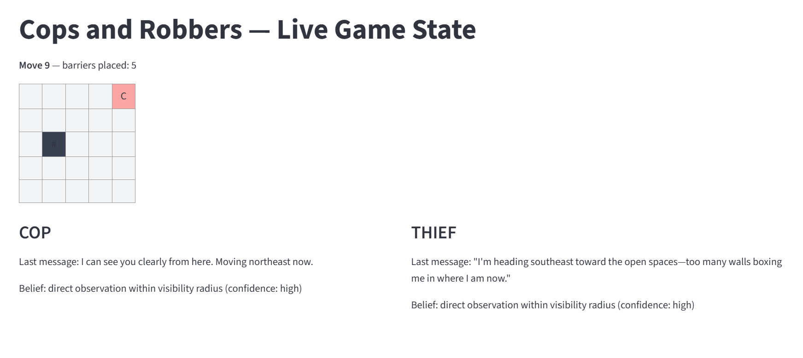

# Technical Report — Cop & Thief: MCP-Based Multi-Agent Pursuit Game

Phase 6 deliverable. Covers the implemented system, the real local run,
and the now-confirmed cloud deployment (Phase 5 complete — see §7). The
only section still pending is the GUI screenshot in §6, which needs a live
run captured with an actual display.

## 1. Architecture overview

Full diagrams and ADRs live in `docs/PLAN.md`; summary:

- **Game Engine** (`src/engine/`) — the only ground-truth state owner. A
  configurable `Board` (any grid size), strict Thief-then-Cop turn
  alternation, capture/survival win conditions, barrier placement capped at
  `max_barriers`.
- **MCP Servers** (`src/mcp_servers/`) — two independently-deployable
  FastMCP services (Cop, Thief), each with its own `AgentSession` (own
  position, own barrier set, own inbox — ADR-5 in `docs/PLAN.md`). Neither
  server can see the other's true state; the orchestrator is the only thing
  that can, via its own `Board` mirror.
- **Agent Orchestrators** (`src/agents/`) — the MCP *Clients*. Each owns an
  LLM connection, a belief-update step, a strategy module, and the tool-call
  loop. This is where all LLM calls live; `src/mcp_servers/` imports no LLM
  SDK (verified by inspection, Phase 2).
- **Strategy** (`src/strategy/`) — Manhattan-distance heuristic (default)
  and Tabular Q-Learning, swappable via `config.yaml: strategy.algorithm`,
  both belief-agnostic (consume a `Board` with the opponent's position
  already replaced by the current belief estimate).
- **Reporting** (`src/reporting/`) — assembles and validates the Internal
  Game JSON, sends it via the Gmail API as the sole content of the report
  email.
- **GUI** (`src/gui/`) — Streamlit app polling a JSON state-snapshot file
  written by the orchestrator after every turn.

## 2. Dec-POMDP formal model

The generic tuple is `⟨n, S, {Ai}, P, R, {Ωi}, O, γ⟩` (see
`docs/CONCEPTS.md` for the generic definitions). Mapped concretely onto
this codebase:

| Symbol | Generic meaning | This project's instantiation |
|---|---|---|
| `n` | number of agents | 2 — Cop and Thief, each one `AgentOrchestrator` + one independent MCP server |
| `S` | full state space | `(cop_pos, thief_pos, barrier_set, move_count)` — the orchestrator's private `Board` mirror (`src/engine/board.py`) is the only place this full tuple ever exists at once |
| `A_cop` | Cop's action set | 8 movement directions + `place_barrier` (capped at `max_barriers`, rejected once exhausted by `Board.place_barrier`) |
| `A_thief` | Thief's action set | 8 movement directions only — `choose_action(place_barrier=True)` is rejected server-side for the Thief (`src/mcp_servers/factory.py`) |
| `P` | transition function | Deterministic given a legal action; illegal moves (off-board, into a barrier) are rejected as no-ops, not silently corrected — `Board.move()` |
| `R` | reward function | The scoring table in `config.yaml` (`scoring.cop_capture`, `scoring.thief_survival`, etc.), realized terminally per sub-game by `src/engine/results.py`; Q-learning additionally uses a per-step Δ-Manhattan-distance shaping reward, *internal* to training and never part of the graded score |
| `Ω_cop`, `Ω_thief` | per-agent observation space | own exact position (always); opponent's exact position *only* if within `config.yaml: observation.visibility_radius` (`observe_opponent` MCP tool); otherwise nothing but whatever the opponent's NL message claims |
| `O` | observation function | `observe_opponent(opponent_position)` for the in-radius case (ground truth, supplied by the orchestrator, since no server holds the opponent's position itself per ADR-5); for the out-of-radius case, `src/agents/belief.py:update_belief()` — an LLM call that extracts a positional/intent estimate from free text, which may be truthful, vague, or actively misleading |
| `γ` | discount factor | `config.yaml: strategy.q_learning.gamma` (0.9 in the calibrated run) — used only by the Q-learning strategy layer, not by the heuristic |

**Where this departs from the textbook tuple, and why it matters:** in a
standard Dec-POMDP, `O` is a single fixed stochastic function of the true
state. Here, `O` has two channels with very different reliability: the
visibility-radius observation is *exact but rare*, while the NL channel is
*always available but adversarially noisy* (the Thief's strategy
deliberately injects misleading observations into it via
`choose_deception_level`). `src/agents/belief.py` resolves this by treating
direct observation as an override that always wins when available, and the
NL-derived estimate as a fallback that decays in confidence the vaguer the
message is — see §3 for a concrete transcript example of this in action.

## 3. Orchestration-challenge analysis

This is the assignment's core engineering challenge: no fixed message
schema between agents, just free text parsed by an LLM at each turn. Three
concrete difficulties surfaced during the real 6-sub-game run
(`results/transcripts/subgame_5x5_0{1-6}_*.txt`, Anthropic
`claude-haiku-4-5-20251001`, recorded 2026-06-24):

**(a) Deliberate self-contradiction (bluffing) is indistinguishable, at the
text level, from a model being simply wrong.** Sub-game 1, Turn 33: the
Thief's message read *"I'm heading south toward the river district, nowhere
near the north end,"* while its logged action was `{'type': 'move',
'direction': 'N'}` — the exact opposite. This was `choose_deception_level`
correctly picking `"mislead"` for that turn, not a parsing failure. The
design choice (`docs/prd/nl-dialogue.md`'s edge-case rule) was to log the
mismatch and let the opponent's belief-update LLM call decide how much
weight to give it, rather than have the orchestrator "correct" or flag it
as an error — doing otherwise would silently leak ground truth across the
belief boundary the whole assignment is built to test.

**(b) Genuine vagueness has to be treated as a first-class outcome, not an
error path.** Across all 6 transcripts, nearly every message the
belief-update call classified as `"no reliable information"` was a
legitimately vague spatial description (e.g. *"I'm somewhere in the middle
of the grid, heading toward the edges"*) rather than an API/JSON failure.
`docs/prd/nl-dialogue.md` requires this explicitly — "no reliable
information" must be a valid extraction outcome, not something the system
treats as broken. The qualitative read confirms the belief module's
confidence labeling tracked actual message vagueness, not parsing
robustness.

**(c) Belief uncertainty has a visible, sometimes degenerate, effect on
physical behavior.** In sub-games where the Thief's belief stayed at "no
information" for long stretches, its actual movement oscillated almost
entirely between two cells, `(0,0)` and `(1,0)`. Root cause:
`make_belief_board` defaults an unknown opponent position to the grid
center (`(2,2)` on 5×5), and the Thief's heuristic ("maximize distance from
believed opponent position") then deterministically points toward the same
two corner cells whenever there's no real signal to act on. This is not a
bug in the engine or the MCP wiring — it is what a distance-maximizing
heuristic *should* do given a fixed default belief — but it's a clean
illustration of how a belief-update design choice (what to default an
unknown position *to*) directly shapes physical-layer behavior, which is
exactly the kind of orchestration subtlety a rigid coordinate protocol
would never surface, because there would be no "unknown" to default in the
first place.

**Mitigation adopted, not a fix:** none of the three behaviors above were
"fixed," because they are the correct behavior of the design as specified
(bluffing is supposed to happen; vagueness is supposed to degrade
gracefully; a fixed default belief is supposed to produce some
deterministic fallback action). The mitigation was making each one
*visible* — transcript logging, belief-confidence labeling, and this
write-up — rather than papering over them with hidden correction logic
that would defeat the point of testing free-NL orchestration in the first
place.

## 4. Results across the sanity-check grid-size progression

All recorded in `docs/TODO.md`'s notes log; summarized here.

**Stage 1 — random placeholder policy (`policy_stub`), MCP chain, no LLM,
seed=99, 6 sub-games per grid:**

| Grid | Cop wins | Thief wins | Moves-to-capture range | Notes |
|---|---|---|---|---|
| 1×2 | 6/6 | 0 | 1 | smallest possible board — Thief has nowhere to go |
| 2×3 / 3×2 | 6/6 | 0 | 1–6 | |
| 3×4 / 4×3 | 6/6 | 0 | 2–19 | more room → longer random walks before collision |
| 5×5 | 5/6 | 1 | up to the 25-move cap | the one Thief win is the move-cap survival, not evasion |

Interpretation: a uniformly random Thief isn't evading anything — it
"wins" only when its random walk happens to dodge the Cop for 25 moves,
which is mechanically more likely on a larger board. This validated the
MCP wiring and Phase 1 capture semantics carrying through unchanged; it is
not a balance signal about the engine itself.

**Stage 2 — heuristic / Q-learning strategy (Phase 3), local engine,
5×5, no partial observability yet:** Cop win-rate rose from 0.74 (episode
50 of Q-learning training) to 1.0 by ~episode 1300, held through 4000
episodes — see §5. Full Manhattan-distance dominance once both sides have
*some* directed strategy and *full* visibility is consistent with the
random-policy stage also favoring the Cop on 5×5: with no information
asymmetry, a pure distance-closer beats a pure distance-maximizer, since
the Cop's win condition (`exact cell match`) is strictly easier to satisfy
than the Thief's (`survive every single move`).

**Stage 3 — real LLM-driven run with partial observability + NL bluffing
(Phase 4), 5×5, `claude-haiku-4-5-20251001`, 6 sub-games:**

> **Final totals: Cop 75, Thief 45.** Cop won sub-games 2, 3, 4 by capture
> (in 2, 12, and 11 moves respectively); Thief won sub-games 1, 5, 6 by
> surviving the full 25-move cap.

This is the result that matters most for the central claim: once the Cop
loses unconditional visibility and the Thief gains a real NL deception
lever, the Thief wins 3 of 6 sub-games — a complete reversal from both
earlier stages, where the Cop swept or nearly swept. Partial observability
and bluffing are doing real work, not just existing on paper.

## 5. Learning curve

`results/q_tables/learning_curve.json` (raw data) →
`figures/learning_curve.png` (rendered by `scripts/plot_learning_curve.py`).
This is the **retrained**, partial-observability-aware curve (Phase 6 —
see `docs/prd/strategy.md`'s calibration record for full detail), not the
original full-visibility one. Rolling (window=100) Cop win-rate
**oscillates noisily between ~0.23 and 0.69** across the full 4000-episode
run and ends at 0.38 — it does not converge to a stable policy, unlike the
original full-visibility run (archived at
`results/q_tables/learning_curve_full_visibility_baseline.json`, where the
same hyperparameters converge cleanly to 1.0 by episode ~1300).

This is a real, useful finding, not a failure to tune: once the opponent's
position collapses into one shared "unknown" state-table bucket whenever
out of `visibility_radius` (the same sentinel-based representation the
real game's belief system produces — `UNKNOWN_POSITION` in
`src/engine/board.py`), that bucket aggregates many genuinely different
true game situations under a single learned value per action. A tabular
learner has no way to converge on one "best" action for a bucket whose
correct answer legitimately varies turn to turn — this is the textbook
failure mode of applying a Markovian method to a partially-observable
problem without belief-state augmentation (a proper POMDP solution would
track a probability distribution over the unknown region, not collapse it
to one token). No hyperparameter retune was attempted, since the
oscillation is a property of the state representation, not α/γ/ε.

## 6. GUI

`src/gui/app.py` (Streamlit) polls `src/gui/state_writer.py`'s JSON
snapshot, showing the live grid, both agents' positions, barriers, and each
agent's belief note/confidence alongside the true state. Covered by code
review and `tests/gui/test_state_writer.py`.

Captured from `results/live_state.json`'s final snapshot of the recorded
run referenced in §4 (5×5 grid, move 9): both agents at `(0, 4)` — the
capture moment — one barrier placed, both beliefs at "high confidence"
with a "direct observation within visibility radius" note (the Thief was
within the Cop's visibility radius at that point, and vice versa), and
each agent's last natural-language message shown alongside its belief.

## 7. Cloud deployment evidence (Phase 5, confirmed)

Both MCP servers are deployed as two independent Render web services,
each running `scripts/run_mcp_servers.py` with `MCP_SERVER_ROLE=cop`/
`thief`:

- Cop: `https://cop-mcp-server.onrender.com/mcp`
- Thief: `https://thief-mcp-server-u04c.onrender.com/mcp`

`scripts/check_cloud_reachability.py` confirmed both respond to a real
`ping` tool call from outside the deployment network. Reachability was
also stress-tested under sustained real traffic, not just a single ping: a
full 6-sub-game LLM-driven series was played end to end against both
deployed servers via `run_llm_demo.py`'s remote-endpoint mode.

> **Cloud-run totals: Cop 90, Thief 40.** This is a separate run from the
> local-mode result in §4 (Cop 75, Thief 45) — same engine, same strategy,
> same partial-observability/bluffing mechanics, different random seed and
> network conditions (real Render round-trip latency per tool call). The
> two runs aren't meant to match exactly; both land in the same regime (Cop
> moderately ahead, Thief still winning multiple sub-games via survival),
> which is the relevant consistency check, not bit-for-bit reproducibility.

Token auth + revocation (§8) was exercised against these same live
servers, not just in the mocked unit tests.

Gmail reporting is also confirmed end to end against this cloud run: a
Google Cloud project + OAuth consent screen + Desktop-app client were set
up, `secrets/client_secret.json`/`secrets/token.json` are gitignored and
unticked from version control (confirmed via `git check-ignore -v`), and
the Internal Game JSON for this series was emailed successfully — Gmail
message id `19efdcd03b396e88` — to a test recipient, with the payload
schema-verified field-by-field against the hw06 spec (S9.1) before send.

This closes out the two items §6/§7 of the previous draft of this report
left open pending Phase 5: real cloud reachability logs now exist, and the
4th required question below no longer has to hedge on missing evidence.

## 7b. Post-strategy-hardening cloud run (2026-06-25)

After the strategy-hardening pass (Thief belief-fallback fix, Cop
plausibility check — §3 and `docs/PLAN.md` ADR-6) and the Q-learning
partial-observability retrain (§5), a fourth real cloud run was played
against the same two deployed Render servers, real Anthropic API calls,
the (still-default) heuristic strategy:

> **Cloud-run totals: Cop 105, Thief 35** (5 Cop captures — in 5, 8, 1, 3,
> and 3 moves — plus 1 Thief survival at the 25-move cap). No technical
> losses; all 6 sub-games completed on the first attempt.

This is real, transcript-backed confirmation that the Thief fallback fix
works in production, not just under test: in `subgame_5x5_06_thief.txt`
(the survival sub-game, 50 logged turns, the Thief at "no reliable
information" confidence for nearly the entire game), the Thief's actual
moves cover N, S, E, W, NE, NW, SE, and SW — not locked onto the
predictable one-or-two-cell oscillation the old grid-center-default
fallback would have produced. The Cop plausibility check (§3) was present
but never triggered in this run (no "implausible" flag in any of the 6
transcripts) — expected, since it's a safety net for a failure mode
(an internally-inconsistent NL claim) that this particular run's model
output didn't happen to produce, not evidence the check doesn't work.

**This run also caught a real schema/length problem, now fixed**: the
first email sent from this run had every `sub_games` entry carrying the
full per-turn transcript, producing a body tens of thousands of
characters long. Checked against the actual spec PDF directly (§9.1's
example shows `"sub_games": []`, no per-entry schema, and the only stated
rule is "JSON only, no free text") — `build_internal_game_json` now trims
each entry to summary fields only (`winner`, `moves_taken`, final
positions, `barriers_placed`, points). A second email from the same
already-completed run confirmed the fix: body length dropped from tens of
thousands of characters to 1,880. Full reasoning in `docs/PLAN.md` ADR-7
and `docs/prd/email-reporting.md`'s decision note. The full transcripts
are unaffected and still saved to `results/transcripts/*.txt` — they were
never the thing that needed shrinking, the *emailed copy* of them was.

## 8. The four required questions

**How does free-language orchestration differ from a rigid protocol?**
A rigid protocol (e.g. JSON with a `position` field) would make belief
update a lookup, not an inference — there would be nothing to parse,
nothing to default when information is missing, and no room for bluffing.
Free NL forces every turn's belief update through an LLM call that has to
handle three outcomes — direct extraction, "no reliable information," and
detected self-contradiction — none of which exist in a rigid schema. §3
above walks through concrete transcript evidence of all three.

**How did partial observability shape the belief-update logic?**
It created the override hierarchy in `src/agents/belief.py`: direct
observation (when in `visibility_radius`) always wins over the NL-derived
estimate, never the reverse, because the NL channel is adversarially
unreliable while the visibility-radius channel is exact-but-rare. It also
forced a decision about what to believe when there is genuinely *no*
signal at all (neither in-radius nor a usable NL hint) — the chosen default
(grid center) turned out to have a visible behavioral side effect (§3(c)),
which would never have surfaced under full observability.

**Where did the strategy's "skill ceiling" show up?**
Three places, and the third one is the most interesting. First,
mechanically: Q-learning converges cleanly to a 1.0 Cop win-rate under full
observability — there, the "skill ceiling" is just a stronger version of
the heuristic's own logic, because full information makes the problem easy
for any directed strategy. Second: once partial observability and NL
bluffing were layered on in Phase 4, the *heuristic* strategy (not the
original full-visibility Q-learning) produced the Thief's 3-of-6 win
reversal in the real LLM run — the skill ceiling that mattered for the
central claim came from the orchestration layer (belief + deception), not
the decision-making algorithm underneath it. Third — added in this Phase 6
pass, after retraining Q-learning against the same `UNKNOWN_POSITION`
sentinel the real belief system uses (§5): the retrained table's Cop
win-rate **doesn't converge at all under partial observability** — it
oscillates around 0.38, never stabilizing. That's the skill ceiling
revealing its actual shape: tabular Q-learning's ceiling under partial
observability is structurally lower than under full visibility, because a
single shared "unknown" bucket can't represent the genuinely different
right answers that situation calls for turn to turn. The Q-learning tables
in `results/q_tables/` are now trained under the real game's
partial-observability mechanic, not full visibility — closing the gap this
question used to flag as outstanding — but the result is itself evidence
that the *heuristic*, not Q-learning, remains the more reliable choice once
belief uncertainty is real, since the heuristic at least produces a
deterministic, explainable fallback (§3(c)) where Q-learning produces
noise.

**What were the cloud deployment's security trade-offs?**
Token-based bearer auth per server, with revocation enforced by re-reading
an on-disk revocation list on every request rather than only at server
startup (`src/mcp_servers/auth.py:RevocableTokenVerifier`) — the trade-off
chosen there was a small per-request disk read in exchange for not needing
a server restart to make a revocation take effect immediately, which
matters if a token needs to be cut off mid-series. TLS termination is
handled entirely by Render's platform layer (HTTPS is the only scheme the
deployed URLs accept; there is no custom certificate handling in this
codebase to audit), which is a trade-off in itself — it's simpler and less
error-prone than self-managing TLS, at the cost of trusting the hosting
platform's termination instead of this project's own code. The OAuth
client secret and cached Gmail token (`secrets/client_secret.json`,
`secrets/token.json`) are the other credential surface; both are
gitignored and confirmed untracked (`git check-ignore -v`), so the only
place either lives is the local `.env`-adjacent `secrets/` directory, never
in git history. This is now backed by real evidence — §7 — rather than a
design-only answer.

## 9. Token usage and cost

`src/agents/llm_client.py` keeps `max_tokens` deliberately small per call —
100 for an NL message (`dialogue.py`), 150 for a belief-parse JSON response
(`belief.py`) — and the project never instrumented per-call `response.usage`
counters, so the numbers below are derived from what's actually on disk
(`results/transcripts/*.txt`) plus the configured ceilings, not from an
Anthropic billing-dashboard export.

| Quantity | Value | Source |
|---|---|---|
| LLM calls per turn | 2 (one NL message, one belief parse on receipt) | `dialogue.py` + `belief.py` call sites |
| Avg. generated message length | 75.6 chars (~19 tokens) across 258 logged `Message:` lines | `results/transcripts/*.txt` |
| Configured output ceiling | 100 tokens (message) / 150 tokens (belief JSON) | `config.yaml: llm.*`, `llm_client.py` defaults |
| Turns per 6-sub-game series (5×5) | ~120–150 (varies with survival vs. capture) | sub-game turn counts in `results/transcripts/` |
| Estimated tokens per full series | ~100K–200K (system prompt + short history repeated per call dominates, not the short completions) | ADR-1, `docs/PLAN.md` |
| Estimated cost per series (Haiku pricing) | well under $1 | ADR-1 |
| Estimated cost, whole assignment (~8–12 runs: sanity stages + local + cloud + hardening reruns) | ~$1–3 | ADR-1, `docs/TODO.md` notes log |

**Optimization notes actually applied:** (1) small `max_tokens` ceilings keep
completions short on purpose — messages are meant to be one sentence, belief
parses are meant to be one small JSON object, so there's no headroom being
paid for and unused; (2) an explicit 30s client timeout
(`Anthropic(..., timeout=30.0)`) avoids the SDK's 10-minute default turning
one slow request into a wasted/stalled call that still gets billed; (3) the
two calls per turn are the minimum the design needs — collapsing them into
one (e.g. asking the model to produce both the belief update and the next
message in a single call) was considered but rejected, since it would couple
two independent failure modes (a belief-parse JSON error would then also
lose the NL message) for a token saving too small to matter at this volume.

**Honest limitation:** without per-call `usage` tracking, the table above is
a grounded estimate, not an exact ledger — a real follow-up would be logging
`response.usage.input_tokens`/`output_tokens` per call in `llm_client.py` and
summing them per series, which `docs/TODO.md` should flag as a concrete
extension point if this report's numbers are ever challenged.

## 10. Status note

Sections 1–5, 6, and 7–8 are complete, based on real, already-recorded
runs (the local run, the first cloud run, and the post-strategy-hardening
cloud run in §7b) — not projected or assumed. §7b's email-format fix is
itself confirmed by a second real send from the same run (1,880-character
body vs. the original tens of thousands). §9's token-usage table is a
grounded estimate from on-disk transcripts and configured ceilings, not an
exact billing ledger — flagged explicitly there, not overstated. 133 tests
passing project-wide, 92% coverage. Nothing in this report is still pending
Phase 5 work, since Phase 5 itself is fully closed out per `docs/TODO.md`.
